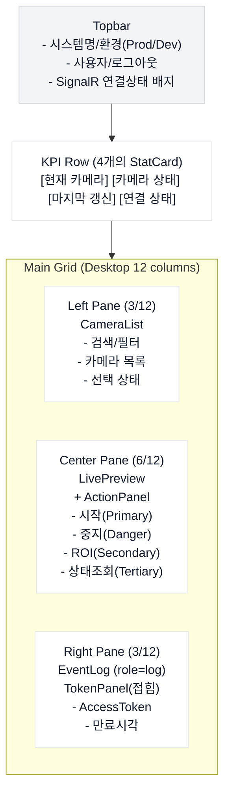
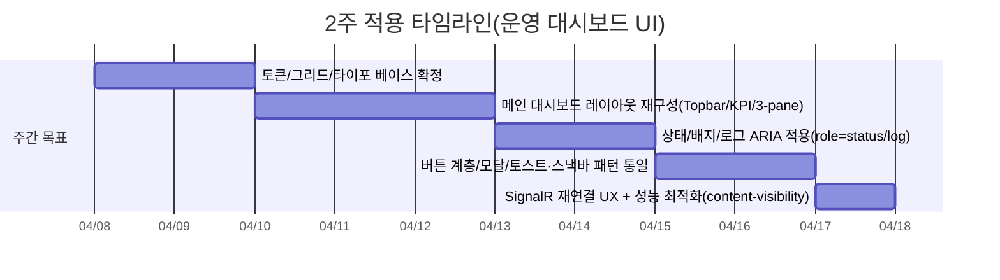

# 2025–2026 운영 대시보드 UI 트렌드와 내 프로젝트 적용 규칙

2025–2026년 운영(Ops) 대시보드 UI는 “**디자인 토큰 기반의 일관성 + 데스크톱 정보 밀도(Compact) 제어 + 고대비/접근성 강화**”가 핵심 흐름입니다. citeturn7search5turn6search7turn6search4turn18view2  
실시간 모니터링 화면의 품질은 “**상태를 빠르게 읽고(시각적 계층) + 오해 없이(라벨/시간/로그) + 키보드/보조기기에서도 동일하게**” 전달하는지로 결정됩니다. citeturn3search0turn19view1turn10search2turn16search3  
구현 측면에서는 SignalR 재연결/비동기 작업의 **표준 UI 패턴(버튼 비활성화, 상태 배지, 토스트/스낵바, 스켈레톤)**을 먼저 고정하고, 로그/리스트/영상에는 성능 최적화(content-visibility, 가상화, 지연 로딩)를 적용하는 것이 1~2주 내 효과가 큽니다. citeturn17view0turn15search0turn4search20turn8search0turn8search6turn8search9  

## 트렌드 관찰과 설계 원칙

국내에서 “**실제 구현 가능한 규칙**”을 가장 촘촘히 제공하는 2025년 자료로는 **정부 디자인 시스템(KRDS)**의 레이아웃/간격/고대비/버튼/배지/모달 가이드가 강력한 기준점입니다. citeturn7search0turn24view2turn18view2turn18view0turn19view1turn22view2  
해외 기준으로는 시각적 스캐닝(상단·좌측 우선), 그리드 기반 계층화, 상태 인지(프리어텐티브 속성), 접근성(WCAG/ARIA)이 운영 UI에 특히 중요하다고 반복적으로 강조됩니다. citeturn3search0turn11view2turn0search2turn1search4turn10search6  
그리고 2025–2026년 “관리자/운영” 화면 트렌드의 실무적 결론은 **화려한 효과를 줄이고(과한 딤드/중첩 금지), ‘정보-행동-피드백’ 흐름을 짧게 만드는 것**입니다. (예: KRDS는 딤드 중첩을 지양하고, 고대비 모드에서는 그림자 대신 경계선으로 구분을 강화하라고 명시합니다.) citeturn18view3turn18view2  

### 요약 표

| 규칙(내 프로젝트 적용 문장) | 우선순위 | 근거/이유 | 구현 팁 |
|---|---|---|---|
| “상단(좌측)에 ‘현재 카메라/상태/마지막 갱신/연결 상태’를 먼저 배치한다.” | 필수 | 사용자는 상단·좌측을 먼저 훑는 경향(F-패턴), KRDS도 중요한 항목을 좌측 상단에 배치 권고. citeturn3search0turn20view0 | Topbar + KPI 1행 고정(Sticky 가능), 나머지는 아래로. |
| “상태는 색만이 아니라 라벨·아이콘·시간(Last updated)으로 중복 표현한다.” | 필수 | 색만으로 의미 전달 금지(접근성), 상태 메시지/라이브영역 필요. citeturn0search4turn10search2 | 배지에 텍스트 라벨, 하단에 1줄 요약. |
| “디자인 토큰(색/간격/타이포)을 먼저 정하고 CSS 변수로 고정한다.” | 권장 | KRDS/Atlassian 모두 토큰을 ‘코드화된 반복 결정’으로 정의. citeturn7search5turn6search7 | `:root{--space-200:16px;}` 식으로 시작. |
| “실시간/비동기 UI는 ‘표준 피드백(스켈레톤/스피너/토스트)’로만 보여준다.” | 권장 | 스켈레톤은 로딩 자리 표시, 토스트/스낵바는 짧은 피드백(행동 방해 최소). citeturn15search0turn22view0turn22view1 | 성공=토스트, 되돌리기/재시도=스낵바, 긴 설명=모달. |
| “로그/리스트/영상은 성능을 의식해 ‘보이는 것만 렌더링’한다.” | 권장 | 큰 DOM은 상호작용 성능 저하, content-visibility/가상화 권장. citeturn8search2turn8search0turn8search6 | 이벤트 로그에 `content-visibility:auto;` + 최대 200~500행 유지. |

## 레이아웃 구조

### 핵심 트렌드와 적용 결론

데스크톱 운영 대시보드는 “**고정된 상단 헤더 + 12컬럼 기반 그리드 + 2~3개 패널(또는 3-pane)**”이 가장 구현·확장·가독성 측면에서 안정적입니다. citeturn24view0turn11view2  
**KRDS는 Desktop 12 column(필요 시 16까지), Tablet 8, Mobile 4**를 기본으로 제시하고, 컬럼 폭은 고정값이 아닌 **백분율 기반**으로 유연하게 적응하라고 권고합니다. citeturn24view0  
또한 간격은 8-point grid를 기준으로 일관되게 유지하고(갭/패딩/반응형 간격), 카드·모달 같은 컨테이너는 토큰 기반 패딩을 쓰라고 명시합니다. citeturn24view2turn4search0  

### 요약 표

| 레이아웃 규칙 | 우선순위 | 근거 | 구현 팁 |
|---|---|---|---|
| 상단 Topbar(시스템명·사용자·연결상태) + KPI 1행 + 본문 패널(좌/중/우) | 필수 | 상단·좌측 우선 스캔, 계층형 그리드가 스캐너빌리티 향상. citeturn3search0turn11view2turn20view0 | KPI는 카드 4개(동일 높이), 본문은 3열 Grid. |
| Desktop 12컬럼(옵션: 16) 기반 CSS Grid | 필수 | KRDS Desktop 컬럼 권장. citeturn24view0 | 12컬럼에서 좌 3 / 중 6 / 우 3 분할(예시). |
| 간격은 8-point(8/16/24…)로만 설계 | 권장 | KRDS 8-point grid 시스템, Atlassian 8px base token. citeturn24view2turn4search0 | `gap: var(--space-200);`처럼 토큰화. |
| “정보 밀도(Compact/Comfortable)” 토글 제공 | 선택 | 운영 화면은 더 많은 정보를 한 화면에 보여줘야 할 때가 많고, KRDS도 글자·화면 설정(크기/모드)을 제공하는 UI를 운영합니다. citeturn19view1turn24view3 | `data-density="compact"`로 padding/line-height만 줄이는 방식 추천. |

### 권장 데스크톱 그리드(내 프로젝트 기준)

- **Topbar**: 고정 높이(예: 56px), 좌측에 “Factory API 운영”, 우측에 “admin / 로그아웃 / SignalR 상태”. (실시간 연결 상태는 항상 보이게) citeturn17view0  
- **KPI 카드 4개(1행)**:  
  - 현재 카메라, 카메라 상태(Running/Stopped), 마지막 갱신 시각, 연결 상태(Connected/Reconnecting/Disconnected)  
  - “상태”는 가장 눈에 띄게(색+라벨) citeturn0search4turn18view2  
- **본문 3열(2행 이하)**:  
  - 좌측: CameraList(목록, 검색/필터) — 중요 항목은 상단, 긴 목록은 페이지/필터 제공 citeturn20view0  
  - 중앙: LivePreview + ActionPanel(시작/중지/ROI/상태조회)  
  - 우측: EventLog(실시간 이벤트), TokenPanel(개발용, 접힘 기본)

### 와이어프레임 예시(mermaid)



### 구현 팁: CSS Grid 뼈대(HTML/CSS)

```html
<div class="dash" data-density="comfortable">
  <header class="dash__topbar">
    <div class="dash__brand">
      <h1 class="dash__title">Factory API 운영</h1>
      <span class="dash__env">DEV</span>
    </div>

    <div class="dash__status">
      <span class="status-badge status-badge--ok" id="hubStateBadge">Connected</span>
      <button class="btn btn--tertiary">로그아웃</button>
    </div>
  </header>

  <section class="dash__kpi" aria-label="요약 정보">
    <!-- StatCard 4개 -->
  </section>

  <main class="dash__grid">
    <aside class="dash__left" aria-label="카메라 목록"></aside>
    <section class="dash__center" aria-label="운영 제어 및 영상"></section>
    <aside class="dash__right" aria-label="이벤트 및 개발 도구"></aside>
  </main>
</div>
```

```css
:root{
  --space-100: 8px;
  --space-200: 16px;
  --space-300: 24px;

  --bg: #f6f7f9;
  --card: #ffffff;
  --text: #111827;
  --muted: #6b7280;
  --border: #e5e7eb;
}

.dash{ background: var(--bg); color: var(--text); min-height: 100vh; }
.dash__topbar{
  display:flex; align-items:center; justify-content:space-between;
  padding: var(--space-200);
  position: sticky; top: 0; z-index: 10;
  background: var(--card); border-bottom: 1px solid var(--border);
}
.dash__kpi{ padding: var(--space-200); display:grid; gap: var(--space-200); grid-template-columns: repeat(4, 1fr); }
.dash__grid{
  padding: var(--space-200);
  display:grid; gap: var(--space-200);
  grid-template-columns: 3fr 6fr 3fr; /* 12컬럼 감각의 비율 분할 */
}

/* 밀도 토글: 운영 데스크톱에서 “더 많이 보기”가 필요할 때 */
.dash[data-density="compact"] .dash__topbar,
.dash[data-density="compact"] .dash__kpi,
.dash[data-density="compact"] .dash__grid{ padding: var(--space-100); }
.dash[data-density="compact"] .dash__kpi,
.dash[data-density="compact"] .dash__grid{ gap: var(--space-100); }
```

(12컬럼 기반/백분율 적응/8-point 간격/패딩 토큰화는 KRDS·Atlassian 가이드와 정합입니다.) citeturn24view0turn24view2turn4search0  

## 상태 표현 방식

### 핵심 트렌드와 적용 결론

운영 UI의 상태는 “**한 눈(색/형태) + 오해 방지(텍스트 라벨) + 신뢰(마지막 갱신 시각/이벤트 로그)**”로 설계합니다.  
특히 **색만으로 상태를 구분하지 말고 라벨을 반드시 붙이라**는 권고는 Atlassian(로젠지)에서 명시적으로 강조됩니다. citeturn0search4  
WCAG는 동적으로 갱신되는 상태 메시지를 보조기기에서도 인지할 수 있도록 **role="status"** 같은 메커니즘을 사용하라고 설명하며, `status`는 기본적으로 `aria-live="polite"`로 동작합니다. citeturn10search0turn10search6  

### 요약 표

| 상태 설계 규칙 | 우선순위 | 근거 | 구현 팁 |
|---|---|---|---|
| 상태는 “색 + 라벨 + (필요 시) 아이콘”으로 중복 표현 | 필수 | 색만으로 의미 전달 금지. citeturn0search4turn19view1 | 배지 텍스트를 짧게(한 줄) 유지. |
| 상태에 “마지막 갱신 시각(Last updated)”을 항상 함께 표시 | 필수 | 실시간 화면의 신뢰 확보(‘멈춘 데이터’를 즉시 인지). WCAG status messages/라이브 영역 패턴에도 부합. citeturn10search2turn10search0 | “마지막 갱신 12:52:30 · 3초 전”처럼 2단 표기. |
| 상태 업데이트는 role="status"(요약) + role="log"(이벤트)로 분리 | 권장 | status는 상태 알림, log는 순차 로그에 적합. citeturn10search0turn16search3turn16search7 | 우측 EventLog에 `role="log"` 적용. |
| 미세 애니메이션은 “재연결/로딩”에만 사용 + reduced motion 존중 | 권장 | `prefers-reduced-motion`으로 비필수 모션 축소. citeturn2search0turn2search4 | reconnecting 배지는 1.2s 느린 pulse. |
| 고대비/색각 이상 대응: 대비 기준(텍스트 4.5:1+, 아이콘 3:1+) 준수 | 필수 | WCAG/국내 접근성 지침의 대비 기준. citeturn1search5turn1search1turn1search14turn18view2 | 배지 텍스트 대비는 4.5:1 이상. |

### 상태 색상 매핑(녹/회/주/빨) 규칙

아래는 “내 카메라 운영 시스템”에 바로 붙일 수 있는 **의미 기반(semantic) 매핑**입니다. (색은 **신호**, 라벨은 **의미**, 시간은 **신뢰** 역할) citeturn19view1turn18view2  

- **녹색(OK/Running/Healthy)**: 정상 동작·수집·연결됨  
- **회색(Stopped/Disabled/Unknown)**: 중지·비활성·정보 없음(운영자가 ‘의도한 중지’ 포함)  
- **주황(Warning/Reconnecting/Degraded)**: 주의 필요·재연결 중·지연/불안정  
- **빨강(Error/Disconnected/Critical)**: 오류·연결 끊김·즉시 조치 필요  

KRDS는 배지에서 “일반적인 의미 체계와 색의 일관성”을 고려하고(예: 경고/반대에 빨강), 색을 과도하게 사용하면 주의가 분산된다고 경고합니다. citeturn19view1  

### 상태 우선순위 규칙(충돌 해결)

실시간 시스템에서는 상태가 겹칩니다. 예: “Running인데 Hub Reconnecting” 같은 경우. 이때 우선순위를 고정합니다.

1. **Critical(빨강)**: 안전/데이터 손실/Disconnected  
2. **Warning(주황)**: Reconnecting, Degraded  
3. **OK(녹색)**: Running/Connected  
4. **Neutral(회색)**: Stopped/Unknown  

이 우선순위는 “운영자가 즉시 판단해야 하는 위험을 먼저 보여준다”는 원칙(오류는 빠르게 인지, 수정 방법 제공)과 맞습니다. citeturn22view3turn20view0  

### 텍스트 요약 문구 샘플(한국어 UI)

- OK: `정상 수집 중 · 마지막 갱신 12:52:30 (3초 전)`  
- Neutral: `중지됨 · 마지막 실행 10:14:02`  
- Warning: `재연결 중… · 최근 30초간 지연됨`  
- Error: `연결 끊김 · 새로고침 또는 서버 상태 확인 필요`  

오류 문구는 “정중한 문체 + 해결 유도”가 중요하다고 KRDS는 명시합니다. citeturn22view3  

### 배지/아이콘 미니 모형(인라인 SVG)

<svg width="760" height="70" viewBox="0 0 760 70" xmlns="http://www.w3.org/2000/svg" role="img" aria-label="상태 배지 예시">
  <rect x="10" y="18" rx="18" ry="18" width="150" height="34" fill="#16a34a"/>
  <text x="85" y="40" text-anchor="middle" font-family="Pretendard, system-ui, sans-serif" font-size="14" fill="#ffffff">RUNNING</text>

  <rect x="170" y="18" rx="18" ry="18" width="150" height="34" fill="#9ca3af"/>
  <text x="245" y="40" text-anchor="middle" font-family="Pretendard, system-ui, sans-serif" font-size="14" fill="#111827">STOPPED</text>

  <rect x="330" y="18" rx="18" ry="18" width="190" height="34" fill="#f59e0b"/>
  <text x="425" y="40" text-anchor="middle" font-family="Pretendard, system-ui, sans-serif" font-size="14" fill="#111827">RECONNECTING</text>

  <rect x="530" y="18" rx="18" ry="18" width="140" height="34" fill="#dc2626"/>
  <text x="600" y="40" text-anchor="middle" font-family="Pretendard, system-ui, sans-serif" font-size="14" fill="#ffffff">ERROR</text>
</svg>

### ARIA 샘플(상태 요약 + 이벤트 로그)

```html
<!-- 상태 요약: 보조기기에 “조용히(polite)” 알려야 하는 변화 -->
<p id="statusSummary" role="status" class="sr-status">
  연결됨. 카메라 1 정상 수집 중. 마지막 갱신 12:52:30.
</p>

<!-- 이벤트 로그: 순차적으로 쌓이는 로그 -->
<ul id="eventLog" role="log" aria-label="이벤트 로그" class="event-log"></ul>
```

(WCAG는 상태 메시지를 role/속성으로 프로그램적으로 판별 가능하게 만들라고 요구하며, role="status"를 사용하는 기법을 제시합니다.) citeturn10search5turn10search0turn16search3turn16search7  

### 미세 애니메이션(재연결만) + reduced motion

```css
.status-badge--warn{
  animation: pulse 1.2s ease-in-out infinite;
}
@keyframes pulse{
  0%,100%{ transform: scale(1); }
  50%{ transform: scale(1.03); }
}
@media (prefers-reduced-motion: reduce){
  .status-badge--warn{ animation: none; }
}
```

(사용자가 모션 최소화를 원할 때 애니메이션을 줄이기 위한 `prefers-reduced-motion` 사용은 MDN/web.dev에서 설명합니다.) citeturn2search0turn2search4  

## 버튼 및 인터랙션 디자인

### 핵심 트렌드와 적용 결론

운영 UI는 버튼이 곧 “사고(incident) 유발 장치”가 될 수 있으므로, **우선순위 계층(Primary/Secondary/Danger/Tertiary) + 키보드 접근 + 비동기 피드백 표준화**가 트렌드이자 필수입니다. citeturn18view0turn1search7turn22view2  
KRDS는 버튼을 “중요도에 따라 다양한 스타일”로 표현하고(계층: primary/secondary/tertiary), 버튼은 Tab/Shift+Tab으로 접근 가능해야 하며 Enter/Space로 실행돼야 한다고 상호작용 가이드를 제공합니다. citeturn18view1turn18view0  

### 요약 표

| 인터랙션 규칙 | 우선순위 | 근거 | 구현 팁 |
|---|---|---|---|
| Start=Primary, Stop=Danger, ROI=Secondary, Status조회=Tertiary | 필수 | KRDS 버튼 계층(Primary/Secondary/Tertiary), Atlassian Danger(파괴적/되돌릴 수 없음) 개념. citeturn18view0turn1search7 | Stop은 별도 확인 모달 권장(옵션: “정말 중지?”). |
| 키보드: Tab 이동, Enter/Space 실행, Focus ring 제공 | 필수 | KRDS 버튼 상호작용, WCAG 2.2 포커스 관련(가려지지 않게, 포커스 표시). citeturn18view0turn1search0turn1search8 | `:focus-visible`로 기준 충족하는 테두리(3:1 변화 대비). |
| 비동기(시작/중지/저장): 스켈레톤/스피너/진행 표시 + 상태 메시지 | 권장 | 스켈레톤/스피너는 로딩 자리 표시/처리 중 안내. citeturn15search0turn4search20turn15search5 | 버튼에 “로딩” 상태(비활성+스피너) 통일. |
| 토스트(성공/정보) vs 스낵바(재시도/되돌리기) vs 모달(긴급/긴 설명) | 권장 | KRDS는 토스트/스낵바 용도와 노출시간/동시 1개 원칙을 제시. citeturn22view0turn22view1 | “저장 완료”=토스트(2~3초), “업로드 실패(재시도)”=스낵바. |
| 모달: 포커스 이동/트랩/닫기 버튼 위치/ESC 닫기 | 필수 | KRDS 모달 접근성(포커스 이동, No Keyboard Trap, 닫기 버튼 마지막). citeturn22view2 | 모달 오픈 시 첫 포커스, 닫으면 트리거로 복귀. |
| 딤드/오버레이는 과도·중첩 금지 | 권장 | KRDS는 딤드 과도 사용·중첩 지양을 명시. citeturn18view3 | 1단계 딤드만 허용, 중첩 모달 금지. |

### 버튼 CSS 클래스 구조(BEM 스타일 예시)

```css
.btn{
  display:inline-flex; align-items:center; justify-content:center;
  gap: 8px;
  height: 36px;
  padding: 0 14px;
  border-radius: 10px;
  border: 1px solid var(--border);
  background: var(--card);
  color: var(--text);
  cursor: pointer;
}
.btn--primary{ background:#2563eb; border-color:#2563eb; color:#fff; }
.btn--secondary{ background:#fff; border-color:#cbd5e1; }
.btn--danger{ background:#dc2626; border-color:#dc2626; color:#fff; }
.btn--tertiary{ background:transparent; border-color:transparent; color:#374151; }

.btn:disabled{ opacity: .55; cursor:not-allowed; }

.btn:focus-visible{
  outline: 3px solid rgba(37,99,235,.5);
  outline-offset: 2px;
}
```

(포커스 표시의 최소 요건 및 “포커스가 화면에서 가려지지 않도록” 하는 요구는 WCAG 2.2 문서에서 다룹니다.) citeturn1search4turn1search0turn1search8  

### 토스트/스낵바 규칙(운영 대시보드에 맞게 번역)

KRDS 기준을 “운영 대시보드”로 옮기면 다음처럼 적용됩니다.

- **토스트(성공/정보)**: 한 줄, 짧게, 사용자가 인지할 시간만큼 노출. 정보형 2~3초, 주의·경고형 3~4초 권장. citeturn22view0  
- **스낵바(낮은 중요도 + 추가 행동)**: 메시지 + “재시도/되돌리기” 같은 간단한 조치 제공, **한 페이지에 하나만**. citeturn22view1  
- **긴급/중요/긴 설명**: 모달 또는 상단 공지(배너/섹션 메시지). (토스트/스낵바는 “중요하거나 긴급한 메시지”에 부적합) citeturn22view0turn22view1  

### 모달 ARIA/키보드 샘플(파괴적 작업 확인)

```html
<button class="btn btn--danger" aria-haspopup="dialog" aria-controls="stopModal">
  카메라 중지
</button>

<div class="modal" role="dialog" aria-modal="true" aria-labelledby="stopTitle" id="stopModal" hidden>
  <h2 id="stopTitle">카메라를 중지할까요?</h2>
  <p>중지하면 실시간 수집이 멈춥니다. 다시 시작할 수 있습니다.</p>

  <div class="modal__actions">
    <button class="btn btn--secondary">취소</button>
    <button class="btn btn--danger">중지</button>
  </div>

  <!-- KRDS 권고: 닫기(X)는 마지막 요소로 배치하는 것이 바람직 -->
  <button class="btn btn--tertiary" aria-label="닫기">닫기</button>
</div>
```

(KRDS는 모달 오픈 시 포커스를 모달/첫 상호작용 요소로 이동, 닫을 때 트리거로 복귀, 모달 내부에서만 포커스가 이동해야 함을 명시합니다.) citeturn22view2  

## 색상 및 타이포 트렌드

### 핵심 트렌드와 적용 결론

2025–2026년의 실무 트렌드는 “**브랜드 색을 남발하기보다, 토큰 기반(semantic)으로 상태/표면/텍스트 대비를 통제**”하는 쪽으로 수렴합니다. (KRDS와 Atlassian 모두 토큰을 스타일 속성의 변수화/코드화를 강조합니다.) citeturn7search5turn6search7turn24view2turn24view3  
또한 국내 기준에서 “선명한 화면 모드(고대비)”는 텍스트/헤딩/아이콘에 대해 더 높은 대비를 요구하며, 가능하면 7:1 이상을 권장하고, 그림자가 약해질 때는 경계선을 활용하라고 설명합니다. 이는 “화려한 효과 배제 + 가독성 중심” 요구와 정합합니다. citeturn18view2turn18view3  

### 요약 표

| 색상/타이포 규칙 | 우선순위 | 근거 | 구현 팁 |
|---|---|---|---|
| 텍스트 대비 4.5:1 이상(가능하면 더 높게), 아이콘/컨트롤 3:1 이상 | 필수 | WCAG 대비/비텍스트 대비, KRDS 고대비 권고. citeturn1search5turn1search1turn18view2 | 배지 텍스트는 최소 4.5:1. |
| 표면(카드) 강조는 ‘약한 그림자 + 경계선’ 중심 | 권장 | 고대비 모드에서 그림자가 약해 경계선 사용 권고. citeturn18view3turn18view2 | 카드 기본은 border 1px + shadow 아주 약하게. |
| 글꼴: 한국어 가독성 좋은 산스(고딕) + 가변폰트 활용 | 권장 | Pretendard는 가변 글꼴 지원, KRDS는 Pretendard GOV 권장 및 본문은 산스 계열 권장. citeturn5search0turn24view1 | `font-family: Pretendard Variable, ...` |
| 라인높이(운영 UI): 기본 150% 전후(본문/레이블), 작은 글자는 신중 | 권장 | KRDS 타이포 토큰에서 line-height 150% 사용, 소형 텍스트 주의. citeturn24view3turn24view1 | Density 토글로 line-height만 줄여도 효과 큼. |
| 토큰(색/간격/타이포)을 SCSS 변수+CSS 변수로 동시 제공 | 선택 | 토큰은 유지보수/일관성에 유리. citeturn6search7turn7search5 | SCSS는 빌드타임, CSS 변수는 런타임 테마. |

### 권장 팔레트(예시) + 토큰 구조

아래 색상 값 자체는 “예시”이지만, **토큰 구조(역할 기반 네이밍)**와 **대비 기준**은 KRDS/WCAG 방향을 따릅니다. citeturn7search5turn18view2turn1search5  

<table>
  <thead>
    <tr><th>역할</th><th>토큰</th><th>예시 값</th><th>샘플</th></tr>
  </thead>
  <tbody>
    <tr><td>배경</td><td>--color-bg</td><td>#f6f7f9</td><td><span style="display:inline-block;width:18px;height:18px;background:#f6f7f9;border:1px solid #ccc"></span></td></tr>
    <tr><td>카드</td><td>--color-surface</td><td>#ffffff</td><td><span style="display:inline-block;width:18px;height:18px;background:#ffffff;border:1px solid #ccc"></span></td></tr>
    <tr><td>텍스트</td><td>--color-text</td><td>#111827</td><td><span style="display:inline-block;width:18px;height:18px;background:#111827;border:1px solid #ccc"></span></td></tr>
    <tr><td>보조 텍스트</td><td>--color-muted</td><td>#6b7280</td><td><span style="display:inline-block;width:18px;height:18px;background:#6b7280;border:1px solid #ccc"></span></td></tr>
    <tr><td>Primary</td><td>--color-primary</td><td>#2563eb</td><td><span style="display:inline-block;width:18px;height:18px;background:#2563eb;border:1px solid #ccc"></span></td></tr>
    <tr><td>OK</td><td>--color-ok</td><td>#16a34a</td><td><span style="display:inline-block;width:18px;height:18px;background:#16a34a;border:1px solid #ccc"></span></td></tr>
    <tr><td>Warn</td><td>--color-warn</td><td>#f59e0b</td><td><span style="display:inline-block;width:18px;height:18px;background:#f59e0b;border:1px solid #ccc"></span></td></tr>
    <tr><td>Error</td><td>--color-error</td><td>#dc2626</td><td><span style="display:inline-block;width:18px;height:18px;background:#dc2626;border:1px solid #ccc"></span></td></tr>
  </tbody>
</table>

### 한국어 UI에 적합한 서체 선택(웹폰트 권장)

- **Pretendard**: 다국어·크로스 플랫폼에서 자연스러운 현대적 글꼴, 9가지 굵기 및 가변 글꼴 지원. citeturn5search0  
- **Noto Sans KR**: 한글/한자 스크립트를 지원하는 한국어용 산스. citeturn5search2  
- **Spoqa Han Sans(Neo)**: SIL OFL로 배포되는 오픈소스 서체. citeturn5search1turn5search9  
- **KRDS(정부) 권장**: 기본 글꼴로 Pretendard GOV 사용, 본문은 작은 크기에도 읽기 쉬운 산스 계열 권장. citeturn24view1  

### 예시 SCSS 변수(토큰)

```scss
$space-100: 8px;
$space-200: 16px;
$space-300: 24px;

$radius-md: 12px;

$bg: #f6f7f9;
$surface: #ffffff;
$text: #111827;
$muted: #6b7280;
$border: #e5e7eb;

$primary: #2563eb;

$ok: #16a34a;
$warn: #f59e0b;
$error: #dc2626;

$font-sans: "Pretendard Variable", "Pretendard", "Noto Sans KR", system-ui, -apple-system, "Segoe UI", sans-serif;
```

(토큰을 코드화해 일관성을 유지한다는 접근은 KRDS/Atlassian의 토큰 정의와 맞습니다.) citeturn7search5turn6search7  

## 개발자 적용 규칙과 구현 패턴

### 컴포넌트 목록(내 프로젝트용)

아래는 질문에 제시된 컴포넌트를 “운영 목적”에 맞게 역할/접근성/실시간 패턴까지 포함해 정의한 것입니다. (각 컴포넌트는 토큰·BEM·ARIA 규칙을 공유)

- **StatCard**: 현재 카메라/상태/연결/갱신 등 KPI  
- **ActionPanel**: Start/Stop/ROI/상태조회 + 비동기 피드백  
- **CameraList**: 카메라 선택(검색/필터/상태 요약 포함)  
- **EventLog**: 실시간 이벤트 기록(연결/상태변경/오류/사용자 액션)  
- **TokenPanel**: AccessToken/만료(기본 접힘, 개발자만 펼침)  
- **ROIEditor**: ROI 편집(드래그 가능하되 대체 접근 경로 고려)  

(긴 목록/강조 과다 금지/중요 항목 상단 배치 등은 KRDS 기본 패턴 가이드와 일치합니다.) citeturn20view0turn19view1  

### HTML 구조 템플릿(StatCard/ActionPanel/EventLog)

```html
<section class="kpi">
  <article class="stat-card" aria-label="카메라 상태">
    <div class="stat-card__label">카메라 상태</div>
    <div class="stat-card__value">
      <span class="status-badge status-badge--ok" id="camState">RUNNING</span>
    </div>
    <div class="stat-card__meta" id="camUpdatedAt">마지막 갱신 12:52:30</div>
  </article>
</section>

<section class="panel panel--action" aria-label="카메라 제어">
  <div class="panel__row">
    <label class="field">
      <span class="field__label">카메라 선택</span>
      <select class="select" id="cameraSelect"></select>
    </label>
  </div>

  <div class="panel__actions" role="group" aria-label="운영 액션">
    <button class="btn btn--primary" id="btnStart">카메라 시작</button>
    <button class="btn btn--danger" id="btnStop">카메라 중지</button>
    <button class="btn btn--secondary" id="btnRoi">ROI 디버그</button>
    <button class="btn btn--tertiary" id="btnRefresh">상태 조회</button>
  </div>

  <p id="actionStatus" role="status" class="sr-status"></p>
</section>

<aside class="panel panel--log">
  <h2 class="panel__title">이벤트 로그</h2>
  <ul id="eventLog" role="log" aria-label="이벤트 로그" class="event-log"></ul>
</aside>
```

(role="status"/role="log" 분리는 W3C/MDN 가이드와 정합입니다.) citeturn10search0turn16search3  

### CSS 네이밍(BEM) 규칙

- 블록: `.stat-card`, `.panel`, `.event-log`, `.status-badge`, `.btn`  
- 엘리먼트: `__title`, `__meta`, `__actions`  
- 모디파이어: `--ok`, `--warn`, `--danger`, `--compact`

이 방식은 “컴포넌트 단위 반복 설계”에 유리하고, 토큰 기반 스타일과 함께 쓰기 좋습니다. citeturn6search7turn7search5  

### SignalR 실시간 상태 반영 패턴(재연결 UI 포함)

**Microsoft 문서가 제시하는 핵심 포인트는 다음 3가지입니다.**

1) `withAutomaticReconnect()`은 기본적으로 0/2/10/30초 대기 후 4번 시도하고, 그동안 상태는 Reconnecting으로 바뀝니다. citeturn17view0  
2) `onreconnecting`에서 “연결 끊김 경고” 및 “UI 비활성화” 기회를 제공합니다. citeturn17view0  
3) `onreconnected`에서 UI를 복구하고 재연결을 알릴 수 있습니다. 재연결이 실패하면 `onclose`에서 영구 단절로 처리합니다. citeturn17view0  

이를 운영 대시보드 규칙으로 바꾸면:

- **Connected**: 정상(녹색 배지) + 마지막 메시지 시간 갱신  
- **Reconnecting**: 주황 배지 + Start/Stop 같은 위험 액션 잠시 비활성(또는 “대기열” 처리)  
- **Disconnected**: 빨강 배지 + “새로고침/재시도” CTA 제공  

```js
const connection = new signalR.HubConnectionBuilder()
  .withUrl("/hub/status")
  .withAutomaticReconnect()
  .build();

connection.onreconnecting((error) => {
  setHubState("reconnecting", error);
  setControlsDisabled(true);          // 운영 액션 보호
  pushLog(`연결 끊김. 재연결 중… (${error?.message ?? "unknown"})`);
});

connection.onreconnected((connectionId) => {
  setHubState("connected");
  setControlsDisabled(false);
  pushLog(`재연결 완료. connectionId=${connectionId ?? "n/a"}`);
});

connection.onclose((error) => {
  setHubState("disconnected", error);
  setControlsDisabled(true);
  pushLog(`연결 종료. 새로고침이 필요할 수 있음. (${error?.message ?? "unknown"})`);
});
```

(위 이벤트 흐름과 “재연결 중 UI 비활성화/알림”은 Microsoft 공식 문서에 직접적으로 예시가 있습니다.) citeturn17view0  

### 낙관적 업데이트(Optimistic) vs 확정 업데이트 규칙

운영 시스템의 Start/Stop은 단순 버튼이 아니라 “실제 장치 상태”를 바꾸는 작업이므로, 다음 규칙이 안전합니다.

- **UI는 ‘요청 중(Pending)’을 먼저 표시**(스피너/배지 점선 등)  
- 서버가 확정 신호를 보내면 Running/Stopped로 전환  
- 타임아웃/실패 시 Error/Warning + “재시도” 스낵바  

이때 상태 메시지는 role="status"로 제공하면 WCAG의 Status Messages 요구를 만족하기 쉽습니다. citeturn10search5turn10search0turn22view1  

### 성능/렌더링 팁(실시간 로그·영상 중심)

실시간 대시보드는 “자주 업데이트”되므로, 성능 규칙을 UI 규칙으로 포함시키는 것이 2025–2026 실무 트렌드에 가깝습니다.

- **EventLog 가상화/제한**: 긴 리스트는 DOM을 과도하게 키워 상호작용을 느리게 합니다. 웹.dev는 큰 DOM이 상호작용에 영향을 주며 `content-visibility` 같은 방법을 제안합니다. citeturn8search2turn8search0  
- **content-visibility 적용**: 화면 밖 패널(예: 접힌 TokenPanel, 아래쪽 로그)은 렌더링 작업을 건너뛰게 할 수 있습니다. citeturn8search0  
- **대량 리스트는 가상화**: web.dev는 긴 리스트 가상화가 DOM 크기를 줄여 성능을 개선한다고 설명합니다. citeturn8search6  
- **영상/스트림 지연 로딩**: 비디오 리소스는 Intersection Observer 기반 지연 로딩을 권장하는 자료가 있습니다. citeturn8search9turn8search17  

```css
/* 접혀 있거나 화면 밖인 패널의 렌더링 비용 절감 */
.panel{
  content-visibility: auto;
  contain-intrinsic-size: 400px; /* 대략값: 레이아웃 점프 감소 */
}
```

### 테스트 체크리스트(접근성/반응성/스트레스)

- **접근성(필수)**  
  - 포커스가 화면에서 가려지지 않음(특히 sticky header 사용 시) citeturn1search0turn1search4  
  - 포커스 표시가 충분히 뚜렷함(포커스 상태 변화 대비 3:1 관련 요구 포함) citeturn1search8  
  - 상태 메시지/토스트가 초점을 빼앗지 않고도 보조기기에 전달됨(role="status") citeturn10search5turn10search0  
  - 로그는 순차 업데이트(role="log") citeturn16search3turn16search7  
  - 색만으로 의미를 전달하지 않음(라벨 포함) citeturn0search4turn19view1  

- **반응성(권장)**  
  - Desktop 12컬럼 기준이 유지되고, 간격이 8-point로 깨지지 않음 citeturn24view0turn24view2  
  - 고대비 모드에서도 정보/기능 손실 없음(경계선/대비 확보) citeturn18view2turn18view3  

- **스트레스(권장)**  
  - 이벤트 로그 초당 N건(예: 10~50)에서도 UI가 멈추지 않음(content-visibility/가상화) citeturn8search0turn8search6  
  - SignalR 재연결 시 버튼 상태/배지가 즉시 일관되게 바뀜 citeturn17view0  

## 적용 체크리스트와 2주 로드맵

### 실행 가능한 체크리스트(우선순위별)

| 범주 | 체크 항목 | 우선순위 | 완료 기준 |
|---|---|---|---|
| 레이아웃 | Topbar + KPI 1행 + 3-pane(좌/중/우)로 재배치 | 필수 | 상단에 상태/갱신/연결이 항상 보임 |
| 레이아웃 | Desktop 12컬럼(옵션 16), 8-point 간격(8/16/24)만 사용 | 필수 | 임의 px 간격 제거, 토큰/변수화 |
| 상태 | 색+라벨+마지막 갱신 시간(Last updated) 기본 제공 | 필수 | Running/Stopped/Error 모두 “시간” 존재 |
| 접근성 | `role="status"` / `role="log"` 적용, 토스트는 포커스 탈취 금지 | 필수 | 스크린리더에서 상태/로그 읽힘 |
| 버튼 | Start(Primary)/Stop(Danger)/ROI(Secondary)/조회(Tertiary) | 필수 | 버튼 스타일·위치가 모든 화면에서 일관 |
| 모달 | 포커스 이동/트랩/닫기 마지막/ESC 등 준수 | 필수 | 키보드로 모달 안에서만 이동, 닫으면 원위치 citeturn22view2 |
| 피드백 | 로딩=스켈레톤/스피너, 성공=토스트, 재시도=스낵바 | 권장 | 로딩/성공/실패 패턴이 통일됨 citeturn15search0turn22view0turn22view1 |
| 색/타이포 | 대비 기준(텍스트 4.5:1+, 아이콘/컨트롤 3:1+) 준수 | 필수 | 고대비 모드에서도 식별 가능 citeturn1search5turn1search1turn18view2 |
| 실시간 | SignalR 재연결(배지+UI 비활성화+로그) 표준화 | 권장 | onreconnecting/onreconnected/onclose UX 추가 citeturn17view0 |
| 성능 | EventLog/TokenPanel에 content-visibility 적용, 로그 최대 행 제한 | 권장 | 이벤트 폭주 시에도 입력 지연 없음 citeturn8search0turn8search2 |

### 2주 개발 적용 로드맵(작업 분해 + 예상 소요)

아래는 “기존 기능 유지, UI만 고급화”를 전제로 한 현실적인 분해입니다. (총 8~10 영업일 기준)



| 작업 | 우선순위 | 산출물 | 예상 소요 |
|---|---|---|---|
| 디자인 토큰(CSS 변수) + 8-point spacing 확정 | 필수 | `tokens.css`(색/간격/타이포) | 0.5~1일 citeturn24view2turn4search0turn7search5 |
| Desktop 12컬럼 그리드 + 3-pane 레이아웃 적용 | 필수 | `index.html` 구조 변경 + `dashboard.css` | 1.5~2일 citeturn24view0turn11view2 |
| StatCard/ActionPanel/EventLog 컴포넌트화(HTML partial 수준) | 필수 | 재사용 마크업/클래스 규칙 | 1~1.5일 citeturn20view0 |
| 상태 배지/요약/Last updated/색맵 통일 | 필수 | `status.ts(or js)` 매퍼 + 배지 UI | 1일 citeturn19view1turn0search4turn18view2 |
| ARIA: role=status/log + 키보드 포커스 링/탭 순서 점검 | 필수 | 접근성 점검표 + 수정 | 1일 citeturn10search5turn10search0turn16search3turn1search8 |
| 토스트/스낵바/모달 패턴 통일(재시도 포함) | 권장 | `toast.js`, `snackbar.js`, `modal.js` | 1~1.5일 citeturn22view0turn22view1turn22view2 |
| SignalR 재연결 UX(onreconnecting/onreconnected/onclose) | 권장 | 연결 상태 배지 + UI disable/enable | 0.5~1일 citeturn17view0 |
| 성능: EventLog 제한/가상화(간단)/content-visibility | 권장 | 로그 성능 안정화 | 0.5~1일 citeturn8search0turn8search6turn8search2 |

(국내 운영/공공 UX의 최신 가이드가 2025년 8월 수정본으로 배포되었고, KRDS가 이를 시스템 형태로 제공한다는 점은 “2025–2026 UI 트렌드가 실제 규칙으로 굳어지고 있음”을 보여줍니다.) citeturn7search7turn7search4turn7search0